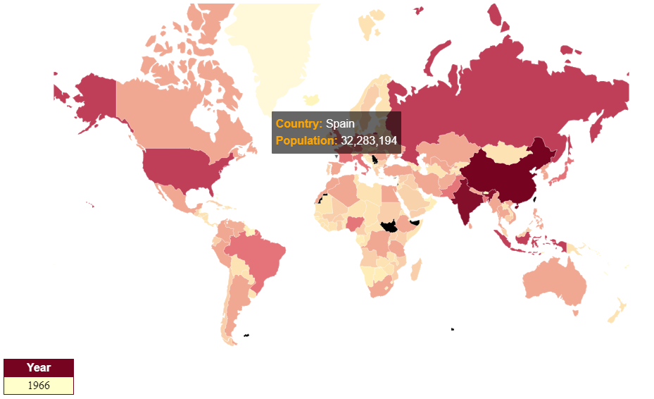

# D3js Visualization World Map (animated version)
## The target of this script is to create a world map chart and display in an animated way, transitioning from 1960 to 2016.


<!--If you want to watch the result [click here](https://raulcrespodiaz.github.io/Visualization_Exercise3/).
-->

### Final result



The chart shows a world map transitionating from 1960 to 2016


---

### Usage

> Open _index.html_ on your favorite web browser.
> You could need to open a lite-server

---

### Implementation overview

The data are in the files:
> _world_countries.json_

> _country-full-population.json_

**0. Data Loading**

The following ode load the data and don´t call to function ready
until the two .json files are loaded

```javascript
queue()
  .defer(d3.json, "world_countries.json")
  .defer(d3.json, "country-full-population.json")
  .await(ready);
```

**1. Refresh Chart**

The following code refresh the chart every n miliseconds (in this example n=1000):

```javascript
//We call these functions
function ready(error, data, population) {
  gdata = data;
  gpopulation = population;
  drawchart();
  setInterval(drawchart, 1000)
}
```

**2. DrawChart**

It´s the function to draw the map

```javascript
function drawchart() {

  var populationById = {};
  var paises = [];

  var maxyear = d3.max(gpopulation, function(d, i) {
    return d.Year;
  });

  var minyear = d3.min(gpopulation, function(d, i) {
    return d.Year;
  });

  if (inityear===0)
    inityear=minyear;
  else if (inityear===maxyear)
    inityear=minyear;
  else
    {    
      inityear++;
    }
  year=inityear;

  document.getElementById("mitexto").innerHTML = year;

  var paises = gpopulation.filter(gdata => gdata.Year === year)
  .map(gdata => ([gdata["Country Code"], gdata.Value]));
  paises.forEach(function (d) { populationById[d[0]] = +d[1]; });
  gdata.features.forEach(function (d) { d.population = populationById[d.id] });


  svg.append("g")
    .attr("class", "countries")
    .selectAll("path")
    .data(gdata.features)
    .enter().append("path")
    .attr("d", path)
    .style("fill", function (d) { return color(populationById[d.id]); })
    .style('stroke', 'white')
    .style('stroke-width', 1.5)
    .style("opacity", 0.8)
    // tooltips
    .style("stroke", "white")
    .style('stroke-width', 0.3)
    ;
}
```


**2.3 draw the leyend on the canvas**

This code is inside drawchar function too

```diff
svg.append("g")
  .attr("class", "countries")
  .selectAll("path")
  .data(gdata.features)
  .enter().append("path")
  .attr("d", path)
  .style("fill", function (d) { return color(populationById[d.id]); })
  .style('stroke', 'white')
  .style('stroke-width', 1.5)
  .style("opacity", 0.8)
  // tooltips
  .style("stroke", "white")
  .style('stroke-width', 0.3)
+  .on('mouseover', function (d) {
+    tip.show(d);
+
+    d3.select(this)
+      .style("opacity", 1)
+      .style("stroke", "white")
+      .style("stroke-width", 3);
+  })
+  .on('mouseout', function (d) {
+    tip.hide(d);
+
+    d3.select(this)
+      .style("opacity", 0.8)
+      .style("stroke", "white")
+      .style("stroke-width", 0.3);
+  })
+  ;
```
