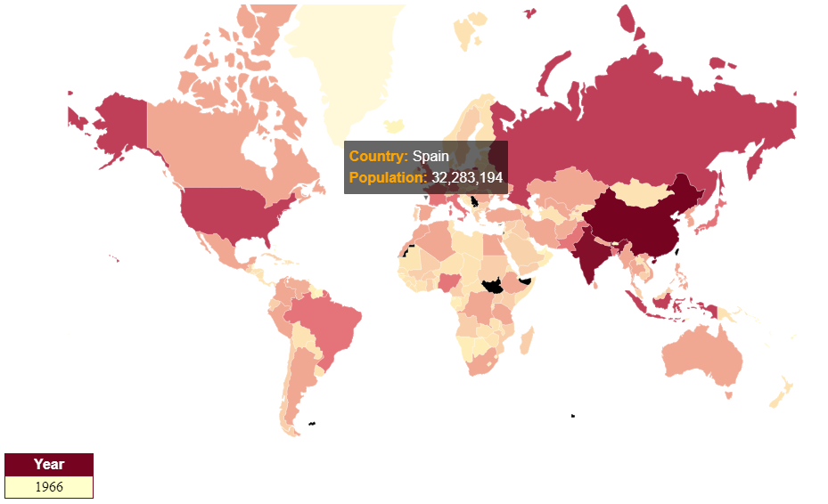
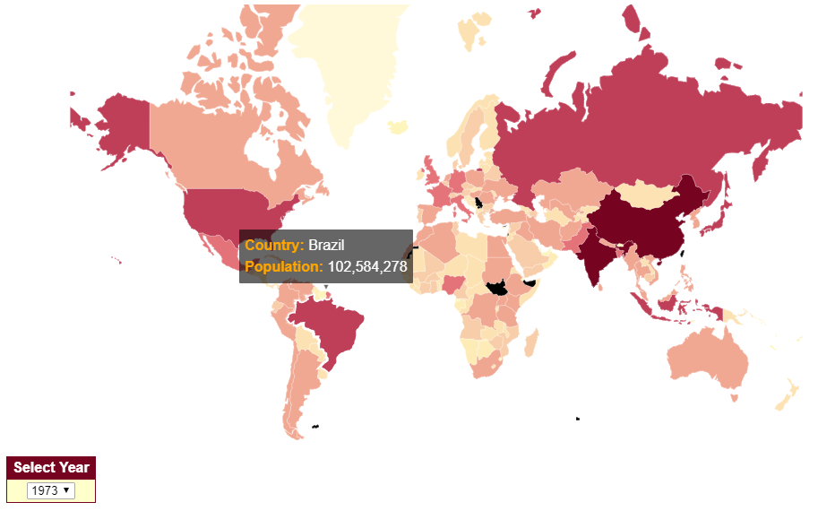

# D3js Visualization World Map
## The target of this script is to create a world map chart and display the poblation of each country from 1960 to 2016.

**2 versions:**
- Animated
- Combo

### Final result

- Animated Version

The chart shows a world map transitionating from 1960 to 2016

- Animated Version

---

### Dataset

The data are in the files:
> _world_countries.json_

> _country-full-population.json_

---

